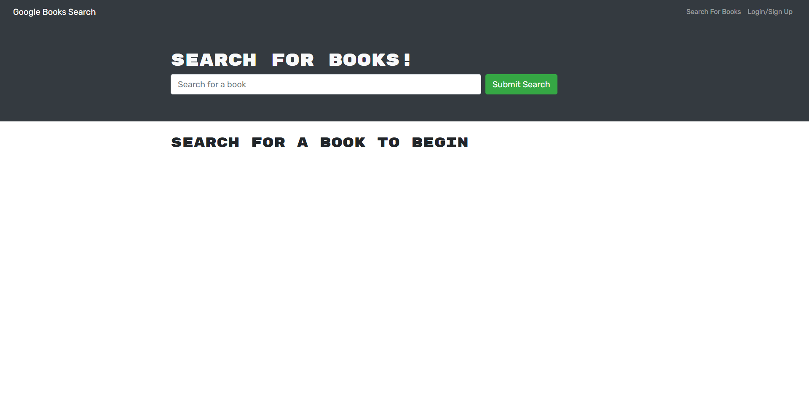

# Find Your Book

## Description

Reactoring the code to setup apollo server for graphql. This application will allow you to search any book. Once you signup and/or login with you email and password, you will be able to save books to your account.

## Installation

```
npm install
```

```
npm run build
```

```
npm run develop
```

## Screenshot



## Link

https://find-your-book-apollo.herokuapp.com/

## Author

Hector Castaneda strides to learn all he can in web development. To achieve the ability to become a full stack developer. Please visit his github: https://github.com/Hectcast508.
